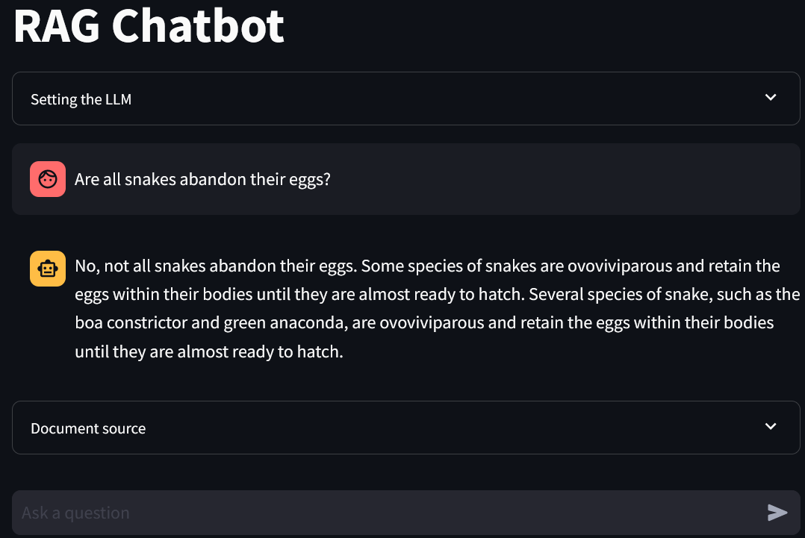

# LLM-RAG
This repo demonstrates the development of Retrieval-Augmented Generation (RAG). 
RAG enables LLM to generate answer text based on custom documents.
This repo also presents the RAG as a chatbot in Streamlit app.

Below is the diagram of the development


# How to Run the App
```streamlit run rag_chatbot.py```

# Interface Display


# The Article 
The article discussing the process of developing this application:

[RAG and Streamlit Chatbot: Chat with Documents Using LLM](https://www.analyticsvidhya.com/blog/2024/04/rag-and-streamlit-chatbot-chat-with-documents-using-llm/)
